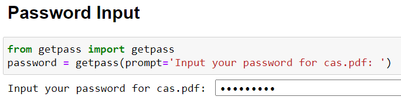

# Mutual Funds Capital Gains

[](https://shields.io/)
[](https://mybinder.org/v2/gh/ajayrawatsap/mf_data/HEAD)


The aim of this project is to calculate number of units required to sell an Equity Mutual Fund so that LTCG (Long-term capital gains) is tax Free. 

For Equity Mutual funds the gains up to 100,000 INR is tax free in a Financial Year. To calculate number of units required to sell a MF scheme so that LTCG is tax free is a complicated process which involves multiple factors such as
1. LTCG is applicable for any Equity MF units sold after one year of its purchase data
2. LTCG up to 100,000 INR is tax free while above this amount is taxable at 10% 
3. Grand-Fathered clause, which means if you have an investment before 31-Jan-2018, then cost of acquisition would be  purchase price or NAV on 31-Jan-2018 whichever is higher
4. If you have a SIP spanning across multiple years then each cost price, sale price and LTCG has to be calculated individually for each SIP

The input to this tool is PDF File from CAMS containing all transactions for a period.
It produces two output files, [Aggregate](data/output/sample_output/sample_output_mf_totals.csv) file at scheme level and [Transaction](data/output/sample_output/sample_output_mf_transactions.csv) file.


A big thanks to team responsible for maintaining [casparser](https://github.com/codereverser/casparser) package which is used to parse CAMS CAS pdf satatement.

## Using Tool with Cloud Environment
**Easy to use as no local installation or set up is required. It is based on cloud virtual machines and can be run on web browsers, with required dependencies already installed**
1. The first step is to get the [consolidated account statement](https://www.camsonline.com/Investors/Statements/Consolidated-Account-Statement) from CAMS in PDF Format. Make sure that you select the option as highlighted in yellow. 
2. [](https://mybinder.org/v2/gh/ajayrawatsap/mf_data/HEAD)
   <br>This will create a cloud VM and install all python dependencies and create a Jupyter Notebook to run the scripts. 
   <br>This may take 10 seconds to one minute depending on source VM image exist or not on server.

   
 
3. After sucessfull creation of VM you will see web based file structure as shown. 
This creates new instance of VM unique to your session and only you can see and edit files. 

   
   
4. Upload your CAS statement downloaded in step 1 and save it as  cas.pdf in root directory as shown
    
    
5. Launch python notebook demo.ipynb from the web repo, it will open in a new browser window tab. Select on Cell and then Run ALL
     
    
6. Input the password for cas.pdf in the input box and press ENTER
   
     
7. The script will run and show the results with Header and Transaction data and will also show you number of units required for tax free LTCG.
   Plese note the VM session remains active only for a small amount time and after inactivity, it gets deleted. Launch [Binder](https://mybinder.org/v2/gh/ajayrawatsap/mf_data/HEAD) again to restart process
 
8. The CSV output gets saved in data/output directory of VM as shown and can be downloaded  by selecting checkbox.
   


## Using Tool in Local Environment
**This is recommended for advanced users who can install python libraries and use command line tools**
1. The first step is to get the [consolidated account statement](https://www.camsonline.com/Investors/Statements/Consolidated-Account-Statement) from CAMS in PDF Format. Make sure that you select the option as highlighted in yellow. 
2. Clone the current github repo. See [help](https://docs.github.com/en/github/creating-cloning-and-archiving-repositories/cloning-a-repository-from-github/cloning-a-repository) for more details. On windows it can be done by opening command prompt tool and runing below commands
   ```
   git clone https://github.com/ajayrawatsap/mf_data.git  
   
   ```
   ```
   cd mf_data
   ```

3. Copy  the PDF file to  *mf_data/data/* folder of repo you downloaded in step 2
   
4. Install the latest [python](https://www.python.org/downloads/)  version 3.9 and required libraries.

   See [requirements.txt ](/requirements.txt) for additional python libraries required and install them using pip command below.
   ```
   pip install -r requirements.txt
   ```
5. Execute python main function using command line. Make sure you are executing from path where main.py file is located. 
    <br>
    <br>**Option 1:** Calculate units to sell for tax free LTCG of INR 100000 (default value). 
    <br> cams_june_27.pdf is the name of PDF file in data directory and password the password for the pdf file. Use the correct file name and password for your file.
   ```
   python main.py cams_june_27.pdf password
   ```
    <br>**Option2:** Calculate units to sell for tax free LTCG of user defined value (INR 50000 in this case)
      ```
       python main.py cams_june_27.pdf password 50000
      ```
6. It will create two output files in directory  data/output/
    1. output_mf_totals.csv: For each mutual fund scheme it will list the total LTCG, STCG, Percent  Gain and Target units to sell for tax free gains. Check sample [output](data/output/sample_output/sample_output_mf_totals.csv) file
    1. output_mf_transactions.csv: This will list transaction level details and claculations for LTCG, STCG and gain percent. Check  sample [output](data/output/sample_output/sample_output_mf_transactions.csv) file.


## FAQ
#### Does it work for Partial Redemptions
  It is assuumed that there are no partial redemptions as the calculations can be wrong. This will be supported in Future
 #### How is Latest NAV and GrandFathered NAV fecthed 
 Latest NAV is fetched from the CAMS statement itself, therefore if you need to have latest calculation use the latest CAMS statement  .
 <br> GrandFathered NAV is fecthed from [AMFI website](https://www.amfiindia.com/nav-history-download)  for date 31-JAN-2018 and list has been parsed and downloaded in [csv file](data/nav/gf_nav_all.csv)

  
#### Calculations are missing for some schemes  
For some MF schemes the calculation may not be possible as the Grandfathred NAV could not be found in CSV file. To resolve such issues Manualy maintain the Grand Fathered NAV(for date 31.01.2018)  in [CSV File](data/nav/gf_nav_all.csv)
 #### Why Calculations are also done for Debt Funds  
  The calculation would also be done for Debt funds but you should ignore it as LTCG for debt funds are calcuated differently. Currently it is not possible to differentiate between Equity and Debt Schemes. In Future only equity funds will be considered
#### On Which OS can the tool run
The tool has been tested in Windows 10 OS with python 3.9, but it should also work in linux/mac environment.  

The cloud based application is OS independent and can be run from web browser on desktop or mobile phones.
#### It does not work correctly for my schemes
 The limited testing has happened on my own Mutual fund Schemes. In case you encounter bug and issue please report it in issues. 

